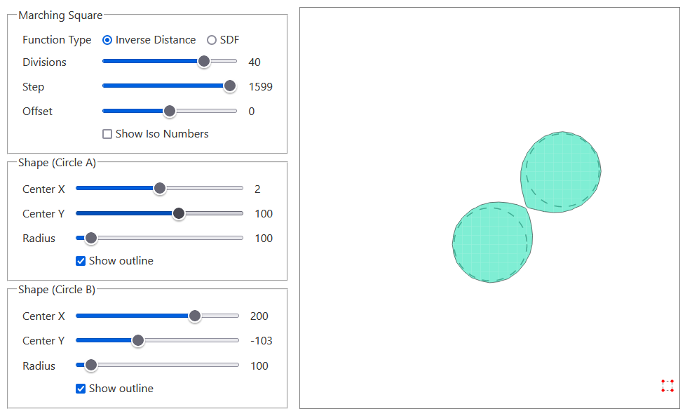

[Live Demo](https://static.laszlokorte.de/marching-squares/)

# Marching Squares

Above you can see how an implicit function describing two circles is converted into a polygon moving a square across the shape and sampling the 4 vertices in each step. 

Each corner of the square can be either inside or outside of the circles (16 possible cases, labled by the iso numbers). Each possible case results in a specific edge being created or not.

The Divisions slider controls the size of the square and by this the number of steps and the resulting resolution. 

The Step slider highlights the square position in a specified step. The squares corners are marked as being inside (green) or outside (red) the target shape. The orange dots show the linear interpolated intersection points of the square&apos;s edges and the target shape.

The target shape consists of two circles. They can be moved and resized via the Shape sliders.